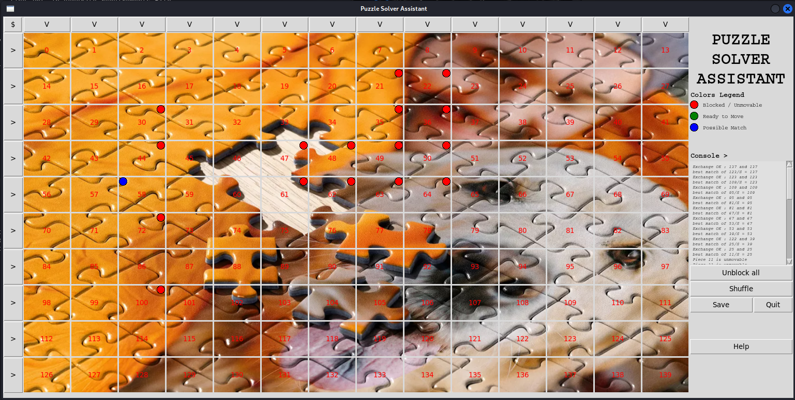

# CTFPuzzleSolverAssistant
An assistant to help to solve some image puzzles. May be useful during CTF

**GUI Assistant to solve some image puzzles**

## Screenshot

## Features
  + Split image in pieces
  + Shuffle pieces to create a puzzle to solve
  + Search best match for a side of a piece
  + Try to solve line by line
  + Try to find the North West Corner
  + Save an image
